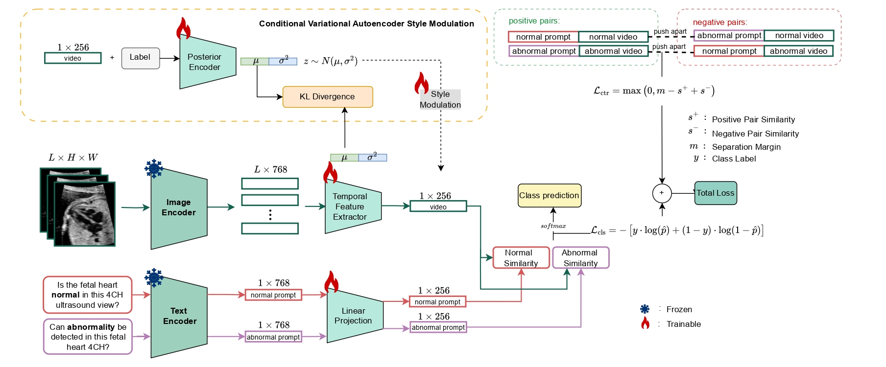

# TPA: Temporal Prompt Alignment for Fetal Congenital Heart Defect Classification

Temporal Prompt Alignment (TPA) is a framework for fetal congenital heart defect (CHD) classification in ultrasound videos that integrates temporal modeling, prompt-aware contrastive learning, and uncertainty quantification. The pipeline relies on pretrained FetalCLIP encoders to align video sequences with class-specific textual prompts, while a conditional variational module modulates temporal embeddings to expose model uncertainty.



## Key Features
- **Foundation-model encoders**: Frozen FetalCLIP vision and text backbones produce rich spatial and semantic embeddings for both modalities.
- **Temporal prompt alignment**: Consecutive ultrasound frames are aggregated with a temporal CNN and contrasted against projected text prompts to maintain video–text consistency.
- **Contrastive + classification objectives**: Margin-based separation of positive/negative prompt pairs complements cross-entropy supervision for CHD detection.
- **Uncertainty estimation**: A conditional variational autoencoder modulates video embeddings, encouraging calibrated predictions and uncertainty-aware outputs.

## Project Structure
- `train.py` – five-fold cross-validation driver with CSV logging and checkpointing.
- `dataset.py` – data utilities that load preprocessed tensors, sample frame clips, and apply CLIP-aligned transforms.
- `model_variants.py` – model definitions, including the temporal prompt alignment network and latent modulation blocks.


## Training
```bash
python train.py \
  --processed_dir ./data/tensors \
  --annotations_path ./data/annotations.csv \
  --classification_type binary \
  --pair_frames_with_text \
  --fetalclip_checkpoint ./weights/fetalclip.pt \
  --batch_size 8 \
  --learning_rate 5e-4
```

## Citation
Please cite:
```bibtex
@misc{taratynova2025tpa,
    title={TPA: Temporal Prompt Alignment for Fetal Congenital Heart Defect Classification},
    author={Darya Taratynova and Alya Almsouti and Beknur Kalmakhanbet and Numan Saeed and Mohammad Yaqub},
    year={2025},
    eprint={2508.15298},
    archivePrefix={arXiv},
    primaryClass={cs.CV}
}
```

## Contact
For questions, reach out to **Darya Taratynova** at [darya.taratynova@mbzuai.ac.ae](mailto:darya.taratynova@mbzuai.ac.ae).
